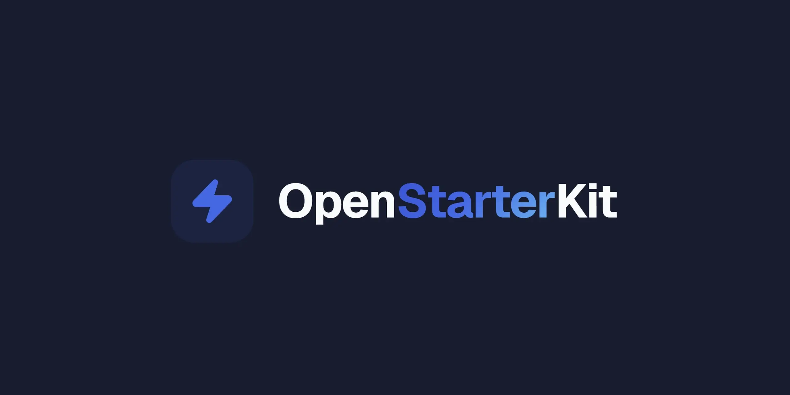

<p align="center">
  
</p>


<p align="center">
  <strong>The free, open-source Next.js SaaS starter kit.</strong><br/>
  Auth, payments, admin and emails, wired up and production-ready. Ship your product this weekend.
</p>

<p align="center">
  <a href="./ROADMAP.md"></a>
  <a href="./LICENSE"></a>
  <a href="https://github.com/openstarterkit/nextjs-saas-starter-kit/actions/workflows/ci.yml"></a>
  
</p>

<p align="center">
  
  
  
  
  
  
  
  
</p>

<p align="center">
  <a href="https://vercel.com/new/clone?repository-url=https://github.com/openstarterkit/nextjs-saas-starter-kit&env=DATABASE_URL,AUTH_SECRET,GOOGLE_CLIENT_ID,GOOGLE_CLIENT_SECRET,GITHUB_CLIENT_ID,GITHUB_CLIENT_SECRET,STRIPE_SECRET_KEY,STRIPE_WEBHOOK_SECRET,NEXT_PUBLIC_APP_URL&envDescription=Required%20environment%20variables%20for%20OpenStarterKit&envLink=https://github.com/openstarterkit/nextjs-saas-starter-kit/blob/main/.env.example&project-name=nextjs-saas-starter-kit&repository-name=nextjs-saas-starter-kit">
    
  </a>
</p>

<p align="center">
  <a href="#-features">Features</a> ·
  <a href="#-tech-stack">Tech stack</a> ·
  <a href="#-quick-start">Quick start</a> ·
  <a href="./docs/README.md">Docs</a> ·
  <a href="#-deploy">Deploy</a> ·
  <a href="#-project-structure">Structure</a> ·
  <a href="./ROADMAP.md">Roadmap</a>
</p>

---

## ✨ Why OpenStarterKit?

Most SaaS boilerplates either cost a few hundred dollars or ship as a barebones demo. **OpenStarterKit is different:**

- 💳 **Payments included in the free tier**: full Stripe Checkout, Customer Portal and webhooks, not paywalled behind a Pro plan.
- 🔓 **No vendor lock-in**: plain PostgreSQL, Prisma and Auth.js. Host it anywhere, own your data.
- 🧩 **A complete SaaS, not a starter demo**: auth, billing, an admin panel with real MRR metrics, transactional emails and a polished landing page.
- 📖 **MIT licensed**: use it for anything, commercial included. No license keys, no unlock fees.
- 🕹️ **A publishable demo, built in**: one env var turns a deployment into a safe public demo of *your* product, with one-click explore accounts and writes disabled. Normally that is something you build yourself.

---

## 🚀 Features

| | Feature | What you get |
|---|---|---|
| 🔐 | **Authentication** | Auth.js v5: Google + GitHub OAuth, magic link, email + password with reset, account linking |
| 💳 | **Payments** | Stripe Checkout, Customer Portal, signature-verified webhooks, subscriptions + one-time payments, multiple tiers, usage-based example |
| 🛠️ | **Admin panel** | User management, search + pagination, live MRR metrics, role toggling |
| 📊 | **User dashboard** | Plan status, billing history, profile & settings |
| 📁 | **Projects CRUD** | A ready example resource with ownership checks to build on |
| 📧 | **Transactional email** | Resend-powered welcome, subscription, magic link & password reset emails |
| 🎨 | **Design system** | Custom Tailwind v4 UI (Button, Card, Badge, Input, Table), brand-neutral by default with one-file or env rebranding |
| 🌗 | **Dark mode** | System-aware theme with no flash of unstyled content |
| 🧱 | **Landing page** | Hero, Features, Pricing and FAQ sections ready to edit |
| 🕹️ | **Demo mode** | Ship a public demo of your product: `DEMO_MODE="true"` gives one-click explore accounts, disabled writes and checkout, and a seeded dataset you can reset |
| ✍️ | **Blog & content** | File-based MDX blog with categories and an RSS feed: write a Markdown file, commit, publish |
| 🔎 | **SEO** | Sitemap, robots, dynamic Open Graph images and Article JSON-LD out of the box |
| 📨 | **Waitlist & contact** | Double opt-in newsletter waitlist (admin export, Resend sync) and a spam-protected contact form |
| 🤖 | **AI-ready** | Ships agent instructions for Claude Code, Cursor and Copilot (`AGENTS.md`) so your assistant is productive on day one |
| ✅ | **CI + security** | GitHub Actions pipeline, security headers, per-endpoint rate limiting, `SECURITY.md`, 0 High/Critical audit |

---

## 🧰 Tech stack

| Layer | Choice |
|---|---|
| **Framework** | Next.js 16.2 (App Router, Turbopack) |
| **Language** | TypeScript (strict mode) |
| **Styling** | Tailwind CSS v4 + dark mode |
| **Auth** | Auth.js v5 (OAuth, magic link, email + password) |
| **Database** | Prisma 7 + PostgreSQL (Neon recommended) |
| **Payments** | Stripe (Checkout + Customer Portal + Webhooks) |
| **Emails** | Resend (welcome + subscription emails) |
| **UI** | Custom design system (Button, Card, Badge, Input, Table) |

### Routes

```
/                    → Landing page (Hero, Features, Pricing, FAQ)
/pricing             → Dedicated pricing page
/login               → Sign in (OAuth, magic link, email + password)
/signup              → Create an account
/forgot-password     → Password reset request (+ /reset-password)
/dashboard           → User overview + plan status
/dashboard/billing   → Subscription management + invoice history
/dashboard/settings  → Profile, sign-in methods & password
/admin               → Admin panel (ADMIN role required)
```

---

## ⚡ Quick start

> 📚 Prefer step-by-step guides? The full documentation lives in [docs/](./docs/README.md) and is rendered at [openstarterkit.dev/docs](https://openstarterkit.dev/docs): getting started, configuration, authentication, deployment.

### 1. Clone and install

```bash
git clone https://github.com/openstarterkit/nextjs-saas-starter-kit.git
cd nextjs-saas-starter-kit
npm install
```

### 2. Environment variables

```bash
cp .env.example .env.local
```

Fill in all variables: see [.env.example](.env.example) for the full list with comments.

### 3. Database setup

Create a PostgreSQL database (Neon recommended, free tier available at [neon.tech](https://neon.tech)), then apply the committed migrations and seed the example data:

```bash
npx prisma migrate deploy   # applies the committed migrations
npx prisma generate         # generates the Prisma client
npx prisma db seed          # seeds two example plans (edit prisma/seed.ts for your own)
```

### 4. OAuth credentials

**Google:** [console.cloud.google.com](https://console.cloud.google.com) → APIs & Services → Credentials → OAuth 2.0 Client ID
- Authorized redirect URI: `http://localhost:3000/api/auth/callback/google`

**GitHub:** [github.com/settings/developers](https://github.com/settings/developers) → OAuth Apps → New OAuth App
- Authorization callback URL: `http://localhost:3000/api/auth/callback/github`

### 5. Stripe setup

1. Create an account at [stripe.com](https://stripe.com)
2. Copy your **Secret key** → `STRIPE_SECRET_KEY`
3. Create your product(s) in the Stripe dashboard. The seed ships two **example**
   recurring prices (monthly + yearly) just so the checkout flow works out of the
   box; replace them with your own product's plans.
4. Copy your **Price IDs** → set `STRIPE_PRO_PRICE_ID` / `STRIPE_PRO_YEARLY_PRICE_ID`
   (or edit `prisma/seed.ts` directly), then run `npx prisma db seed`
5. For webhooks locally, install [Stripe CLI](https://stripe.com/docs/stripe-cli):
   ```bash
   stripe listen --forward-to localhost:3000/api/webhooks/stripe
   ```
   Copy the webhook signing secret → `STRIPE_WEBHOOK_SECRET`

### 6. Resend (email, optional)

1. Create account at [resend.com](https://resend.com)
2. Add and verify your domain
3. Create API key → `RESEND_API_KEY`
4. Set `EMAIL_FROM` to `"OpenStarterKit <hello@yourdomain.com>"`

### 7. Run

```bash
npm run dev
```

Open [http://localhost:3000](http://localhost:3000). 🎉

### 8. Make it yours

Your brand lives in **two files**. Swap them and the whole app follows:

```
src/config/site.ts        # name, tagline, description, contact email, links
src/components/logo.tsx   # logo mark + wordmark
```

Then rewrite the landing copy and the `/privacy` + `/terms` placeholders, and it's your product. Details in [Make it yours](#-make-it-yours).

---

## ☁️ Deploy

Click the **Deploy with Vercel** button at the top, or:

```bash
npm i -g vercel
vercel
```

Set all environment variables in the Vercel dashboard. For Stripe webhooks in production, create a new endpoint in the Stripe dashboard pointing to `https://yourdomain.com/api/webhooks/stripe`.

### Make yourself Admin

After signing in for the first time, run:

```bash
npx prisma studio
```

Find your user in the `User` table and set `role` to `ADMIN`. You'll then see the Admin Panel shortcut in your dashboard.

---

## 🎨 Make it yours

The kit ships **brand-neutral**: a placeholder name and a black + grayscale theme, a blank canvas you make yours. Everything (metadata, navbar, footer, emails, legal pages, Open Graph images) reads from a single source, so you can rebrand two ways:

- **From config**: `src/config/site.ts` (name, tagline, description, links), `src/components/logo.tsx` (the logo mark), and the color tokens in `src/app/globals.css`.
- **From env**: set the `NEXT_PUBLIC_BRAND_*` variables (name, tagline, logo accent, colors) and the app rebrands with no code changes. The gradient, glow and Open Graph images follow your accent automatically. See [Configuration](./docs/configuration.md#branding--theming).

Change those, replace the landing copy, and the kit is fully yours. The only intentional exception is the optional ["Built with" badge](#%EF%B8%8F-attribution--the-badge), which credits the kit itself. The **code is MIT**: use it for anything, no strings attached.

---

## 🕹️ Demo mode

Want a public demo of your product (like [the kit's own demo](https://demo.openstarterkit.dev)) without collecting anyone's personal data? Deploy a second instance of this repo against an **isolated database** and set:

```bash
DEMO_MODE="true"          # on the demo deployment
NEXT_PUBLIC_DEMO_URL=""   # on the marketing deployment → points "Sign in"/"Demo" at the demo
```

With `DEMO_MODE` on, the OAuth buttons are disabled and the login page offers **one-click shared accounts** instead: *Explore as User* and *Explore as Admin* (so visitors can see the admin panel too). Fill the demo database with believable fake users, subscriptions and projects:

```bash
npm run db:seed:demo   # ⚠️ wipes users/projects and recreates fixtures; re-run to reset
```

No real emails, no real payments (use Stripe test keys), nothing to GDPR-worry about.

---

## 📁 Project structure

```
src/
├── app/
│   ├── (public)/          # Landing pages (no auth required)
│   ├── (auth)/            # Login, signup, magic link & password reset pages
│   ├── (dashboard)/       # Protected user area
│   ├── (admin)/           # Admin panel (ADMIN role)
│   └── api/               # API routes (auth, checkout, billing, webhooks)
├── components/
│   ├── ui/                # Design system (Button, Card, Badge, Input, Table)
│   ├── landing/           # Landing page sections
│   ├── billing/           # Stripe billing components
│   ├── dashboard/         # Dashboard-specific components
│   └── admin/             # Admin components
├── lib/
│   ├── prisma.ts          # Prisma client (Prisma 7 + adapter)
│   ├── stripe.ts          # Stripe client (lazy proxy)
│   ├── email.ts           # Resend email helpers
│   └── utils.ts           # cn() utility
├── app/actions/           # Server actions (profile, admin)
└── auth.ts                # Auth.js configuration
prisma/
├── schema.prisma          # User, Account, Session, Plan, Subscription
└── seed.ts                # Seeds example plans (replace with your own)
```

---

## 🧠 Tech decisions

**Why Prisma 7?** New WASM engine requires a driver adapter; we use `@prisma/adapter-pg`. See `src/lib/prisma.ts`.

**Why Stripe lazy proxy?** `new Stripe("")` throws at module load time. The proxy defers instantiation to first request. See `src/lib/stripe.ts`.

**Why Auth.js v5?** Stable API, first-class Next.js App Router support, PrismaAdapter included.

**Why Tailwind v4?** Native CSS variables, no config file needed, `@custom-variant` for dark mode.

---

## 🏷️ Attribution & the badge

OpenStarterKit ships with a small **"Built with OpenStarterKit"** badge in the app footer. It's on by default: it costs you nothing and helps other makers find the kit.

**Want to remove it?** You're completely free to. Just set:

```bash
NEXT_PUBLIC_REMOVE_BRANDING="true"
```

No license to buy, no fee, no unlock: the badge simply disappears.

If the kit saved you a weekend, the nicest way to say thanks is a coffee.
Totally optional: ☕ [buy us a coffee](https://buymeacoffee.com/openstarterkit).

---

## 🗺️ Roadmap & changelog

OpenStarterKit ships continuously and stays free: pull `main` for updates. A paid **Pro** tier (teams & scale) is coming later.

- 📍 [ROADMAP.md](./ROADMAP.md): what's next
- 📝 [CHANGELOG.md](./CHANGELOG.md): what shipped

## 🔒 Security

Found a vulnerability? Please **don't** open a public issue: see [SECURITY.md](./SECURITY.md) for private reporting.

## 📄 License

[MIT](./LICENSE), free for personal and commercial use.

---

<p align="center">
  Built with ❤️ by <a href="https://openstarterkit.dev">OpenStarterKit</a><br/>
  <sub>If this saved you time, a ⭐ on the repo means a lot.</sub>
</p>
